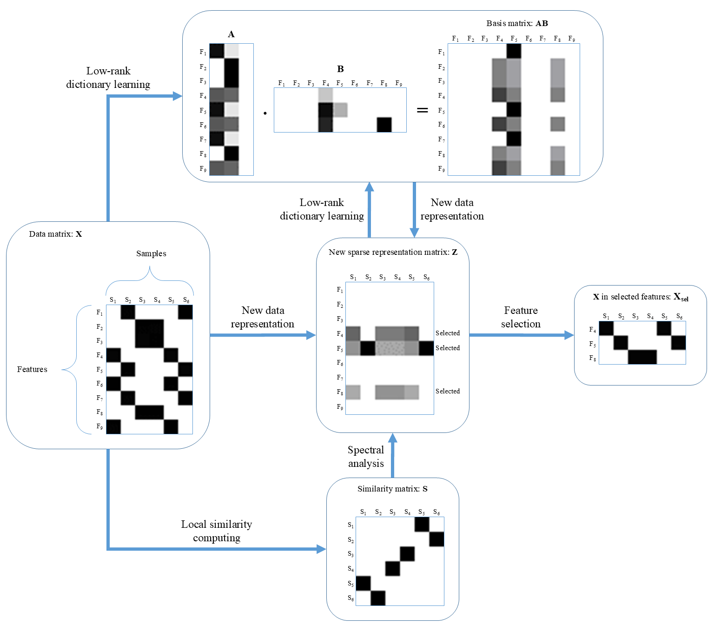

# DLUFS: Low-Rank Dictionary Learning for Unsupervised Feature Selection

[](https://doi.org/10.1016/j.eswa.2022.117149)
[](https://doi.org/10.1016/j.eswa.2022.117149)
[](https://github.com/mohsengh/DLUFS)

Official implementation of the paper:

**Low-rank Dictionary Learning for Unsupervised Feature Selection**

Mohsen Ghassemi Parsa, Hadi Zare, Mehdi Ghatee

*Engineering Applications of Artificial Intelligence*, Volume 202, Article 117149, 2022

DOI: https://doi.org/10.1016/j.eswa.2022.117149

---

## ⭐ If you use DLUFS, please cite our paper

If this repository contributes to your research, experiments, benchmark studies, or applications, please cite:

```bibtex
@article{parsa2022dlufs,
  title={Low-rank dictionary learning for unsupervised feature selection},
  author={Parsa, Mohsen Ghassemi and Zare, Hadi and Ghatee, Mehdi},
  journal={Engineering Applications of Artificial Intelligence},
  volume={202},
  pages={117149},
  year={2022},
  publisher={Elsevier},
  doi={10.1016/j.eswa.2022.117149}
}
```

---

# Framework Overview

The following figure illustrates the overall workflow of DLUFS.

<p align="center">

</p>

**Figure 1.** Illustration of the DLUFS framework. A low-rank dictionary is learned to preserve global feature correlations while spectral analysis preserves local sample similarities. Features are ranked according to the learned sparse representation matrix.

---

# Why DLUFS?

Most unsupervised feature selection methods exploit only a subset of important characteristics such as sparse learning, graph learning, reconstruction, or subspace learning.

DLUFS integrates all of the following components into a unified optimization framework.

| Property                | DLUFS |
| ----------------------- | ----- |
| Sparse Learning         | ✓     |
| Subspace Learning       | ✓     |
| Spectral Analysis       | ✓     |
| Joint Learning          | ✓     |
| Data Reconstruction     | ✓     |
| Dictionary Learning     | ✓     |
| Low-Rank Representation | ✓     |

Compared with previous dictionary-learning-based methods, DLUFS explicitly introduces a low-rank representation to capture feature correlations while removing redundant and noisy dimensions.

---

# Abstract

High-dimensional datasets often contain redundant, noisy, and irrelevant features that degrade learning performance and increase computational complexity.

DLUFS (Dictionary Learning-based Unsupervised Feature Selection) is a novel feature selection framework that combines:

* Dictionary Learning
* Low-Rank Representation
* Spectral Analysis
* Sparse Learning via ℓ₂,₁ Regularization

The method jointly learns a low-rank dictionary and a sparse representation while preserving both:

* Global feature correlations
* Local sample similarities

Experimental results on benchmark datasets demonstrate that DLUFS consistently achieves competitive or superior performance compared with state-of-the-art unsupervised feature selection methods.

---

# Key Contributions

### Low-Rank Dictionary Learning

Learns a compact dictionary representation that preserves feature correlations and suppresses noisy dimensions.

### Spectral Graph Regularization

Preserves local neighborhood structures among samples through graph Laplacian learning.

### Sparse Feature Ranking

Employs ℓ₂,₁ regularization to identify informative features and discard redundant ones.

### Unified Optimization Framework

Jointly learns dictionary matrices, sparse representations, and graph structures.

### Strong Empirical Performance

Outperforms or matches state-of-the-art unsupervised feature selection approaches on multiple benchmark datasets.

---

# Method

Given a data matrix

X ∈ ℝ^(p×n)

DLUFS solves:

min(A,B,Z)

||X − ABZ||²_F

* α Tr(ZLZᵀ)

* λ ||Z||₂,₁

where

* A and B define a low-rank dictionary
* Z is the learned representation matrix
* L is the graph Laplacian
* α controls graph regularization
* λ controls sparsity

The learned representation matrix is then used to rank and select informative features.

---

# Algorithm

1. Construct a k-nearest-neighbor similarity graph.
2. Compute the graph Laplacian matrix.
3. Learn low-rank dictionary matrices A and B.
4. Update sparse representation matrix Z.
5. Repeat until convergence.
6. Rank features according to row norms of Z.
7. Select top-ranked features.

# Benchmark Datasets

The experimental evaluation includes the following benchmark datasets:

| Dataset   | Samples | Features | Domain     |
| --------- | ------- | -------- | ---------- |
| BA        | 1404    | 320      | Image      |
| Colon     | 62      | 2000     | Biology    |
| GLIOMA    | 50      | 4434     | Biology    |
| Madelon   | 2600    | 500      | Artificial |
| ORL       | 400     | 1024     | Image      |
| PCMAC     | 1943    | 3289     | Text       |
| WarpAR10P | 130     | 2400     | Image      |
| Yale      | 165     | 1024     | Image      |

---

# Experimental Results

DLUFS was evaluated using:

* Clustering Accuracy (ACC)
* Normalized Mutual Information (NMI)

and compared against:

* AEFS
* CDLFS
* JELSR
* LDSSL
* LS
* MCFS
* NDFS
* SPFS
* SRFS
* UDFS

Experimental results demonstrate that DLUFS achieves state-of-the-art or highly competitive performance across a variety of high-dimensional datasets.

---

# Applications

DLUFS can be applied to:

* Bioinformatics
* Gene Expression Analysis
* Text Mining
* Computer Vision
* Pattern Recognition
* Data Mining
* High-Dimensional Data Analysis
* Machine Learning Preprocessing

---

# Citation

Please cite the following paper if you use this repository:

```bibtex
@article{parsa2022dlufs,
  title={Low-rank dictionary learning for unsupervised feature selection},
  author={Parsa, Mohsen Ghassemi and Zare, Hadi and Ghatee, Mehdi},
  journal={Engineering Applications of Artificial Intelligence},
  volume={202},
  pages={117149},
  year={2022},
  publisher={Elsevier},
  doi={10.1016/j.eswa.2022.117149}
}
```

---

# Related Publications

### Low-rank Dictionary Learning for Unsupervised Feature Selection

Engineering Applications of Artificial Intelligence, 2022

DOI:

https://doi.org/10.1016/j.eswa.2022.117149

---

# Contact

Mohsen Ghassemi Parsa

Email: [mgparsa@ut.ac.ir](mailto:mgparsa@ut.ac.ir)

GitHub:

https://github.com/mohsengh

---

# Support

If you find this repository useful:

⭐ Star the repository

📄 Cite the paper

🔁 Share it with other researchers

These actions help increase the visibility and impact of the research.
